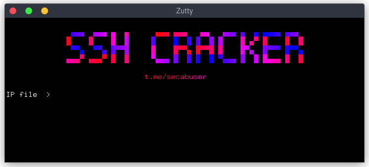

# SSH Cracker



---

## Features
  - Fast
  - 100% Accurate
  - Check Access

---

## Requirements
- Python 3.x or later
- Required libraries:
  - `paramiko`
  - `pystyle`
  - `colorama`

Install dependencies using:
```bash
pip install -r requirements.txt
```

---

## How to Use

### Linux
#### Step 1: Install Prerequisites
1. Verify Python 3.x is installed:
   ```bash
   python3 --version
   ```
2. If Python isn’t installed, use the following commands to install:
   ```bash
   sudo apt update
   sudo apt install python3 python3-pip
   ```
3. Install necessary libraries:
   ```bash
   pip3 install paramiko pystyle colorama
   ```

#### Step 2: Prepare Input Files
- **IP File**: Contains IP addresses and ports in `<IP>:<Port>` format. Example:
  ```
  192.168.1.1:22
  192.168.1.2:22
  ```
- **Username File**: Contains a list of usernames, one per line. Example:
  ```
  admin
  root
  ```
- **Password File**: Contains a list of passwords, one per line. Example:
  ```
  password123
  admin@123
  ```

#### Step 3: Run the Script
- Execute the script:
  ```bash
  python3 main.py
  ```

#### Step 4: Follow the Prompts
The script will ask for:
1. Path to the IP file.
2. Path to the username file.
3. Path to the password file.
4. Maximum number of threads.

#### Step 5: Check Results
After completion, view the generated log files:
- `good.txt`: Records successful connections.
- `error.txt`: Contains authentication errors.
- `no-access.txt`: Logs inaccessible IPs or ports.

Use commands like `cat` to check logs:
```bash
cat good.txt
```

---

### Windows
#### Step 1: Install Python
1. Download Python from [https://www.python.org/](https://www.python.org/) and install it.
2. During installation, ensure **Add Python to PATH** is selected.
3. Verify installation by opening `cmd` and typing:
   ```cmd
   python --version
   ```

#### Step 2: Install Required Libraries
1. Open Command Prompt (`cmd`).
2. Install libraries:
   ```cmd
   pip install paramiko pystyle colorama
   ```

#### Step 3: Prepare Input Files
- **IP File**: Create a text file with IPs and ports in `<IP>:<Port>` format. Example:
  ```
  192.168.1.1:22
  192.168.1.2:22
  ```
- **Username File**: Create a file with usernames. Example:
  ```
  admin
  root
  ```
- **Password File**: Create a file with passwords. Example:
  ```
  password123
  admin@123
  ```

#### Step 4: Run the Script
Execute the script:
```cmd
python main.py
```

#### Step 5: Follow the Prompts
Provide:
1. Path to the IP file.
2. Path to the username file.
3. Path to the password file.
4. Maximum number of threads.

#### Step 6: Check Results
After completion, logs are generated in the following files:
- `good.txt`
- `error.txt`
- `no-access.txt`

Open these files using Notepad or any text editor to view results.

---

### Additional Notes
1. **Log Management**:
   - Logs are cleared at the start of each execution to avoid duplication.
2. **Terminal Optimization**:
   - The script clears the terminal after inputs are provided and reprints the banner for a clean interface.
3. **Compatibility**:
   - Works on both Linux and Windows systems.
